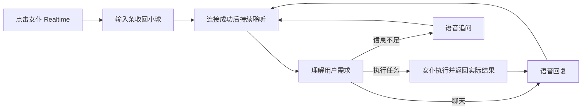

# 女仆 Realtime 交互与实现

评估／实施日期：2026-09-21。用户确认后已实现以下功能；后文保留原设计及实施前的代码依据。
2026-09-23 更新：语音任务改为“接收 → 执行 → 汇报”三拍摘要、小球外圈状态与口头“允许”确认，见 `docs/maid-run-card-design.md`。

## 已实施

- **原小球**：保留 `.mode-switch-btn` 与原彩色环，只叠加实际音量驱动的声纹、麦克风标记及简短状态。女仆启动不再显示聊天室通话面板，输入条收起时保留草稿、附件、结果并收回键盘。长按仍打开输入条，通话期间不自动聚焦；拖动保留原逻辑。
- **紧凑控制**（按 0.7.3 反馈调整）：语音期间单击小球仍切换聊天／创意写作；点击球旁的信息摘要，展开暂停／恢复麦克风、暂停／恢复播报、结束语音、停止当前任务及记录入口。点外部或 Escape 仅收起控制，关闭后焦点回到摘要。字幕与用量按需展开。连接失败保留短提示及重新连接入口。
- **持续任务**：Realtime 委派请求进入原女仆队列；先返回任务 ID 与已接收状态，实际执行结果另行回传。任务与话筒分离，挂断不取消已接收工作，迟到结果不进入新通话。状态／取消不排在长任务之后，修订会停止未完成部分再排队；参考图和原目标一起保留。文字补充也进入同一队列并回传播报。
- **上下文与记录**：接收时克隆会话、页面、选择对象；工具省略会话参数时在校验与确认前填入固定的目标。跨页面的旧截图选区拒绝重新截取其他页面。工具 `task_id` 可显式引用前一项工作的目标和附件。Live 的常见图片指代复用最近任务参考。原有工具确认保留；任务结果以请求／通话 ID 关联，避免把任务转述再次存成独立用户发言。切会话／重置会话只结束聊天室通话。
- **展示仲裁**：语音任务默认由小球接收状态，不自动展开执行流；打开女仆输入条时仍可查看原完整轨迹和结果。

| 协议 | 实现路径 |
| --- | --- |
| OpenAI Realtime | `session.tools` 注册 `maid_task`；只接收完成响应中的完整函数调用，函数结果回填后继续音频回应，支持并行函数结果统一恢复 |
| OpenAI GPT-Live | 女仆使用 `client` delegation；仅明确委派事件触发任务，结合时间戳字幕并短暂等待迟到片段；结果用 `session.commentary.append` 回传。聊天室保留托管 Responses |
| Gemini Live | `functionDeclarations`、`toolCall.functionCalls` 与 `toolResponse`；先返回接收结果，长任务完成后通过 `clientContent` 通知，适配同步工具调用模式 |
| xAI／Qwen-Audio／Step | 按各自函数 schema 注册，接收完整调用，回填 `function_call_output` 并发起下一次回应 |
| Nova Sonic | `toolConfiguration`、完整 TOOL 内容块与 `toolResult`；后续实际结果通过交互式文本内容回传 |
| 豆包实时语音 | 本项目这条直连协议尚未接通可靠任务委派；启动前明确提示更换设置档，不先申请麦克风或假装能执行任务。聊天室原语音不受影响 |

Live 委派没有函数参数：明确停止／进度／修正语句先走本地控制，其他委派由女仆 Agent 处理；不会把每次字幕刷新视为新请求。

完整模块边界：`maid-voice-orb-ui.js` 负责原球展示，`maid-voice-task-runtime.js` 负责独立任务生命周期，`realtime-maid-task-session.js` 负责通话内协议去重、委派与结果回传。`maid-command-submit-runtime.js` 从 `app.js` 提取完整单次提交逻辑，并明确加入语音来源、固定上下文和记录规则；这是功能改动，未把这些行为变化宣称为等价重构。

## 验证与边界

新增 `scripts/tests/maid-realtime-task-tests.mjs`，并扩展实际指令队列及执行流专项；影响范围的通话、Live、多服务商、女仆 Agent、会话进入、历史与小球交互检查通过。`npm run test:maid-realtime` 提供日后回归入口，本轮按改动范围分批运行，只在改动或失败后续验。i18n 简／繁／英目录完整，UI／内容扫描无新增未登记项，主题审计无新增风险。

Windows 普通 `npm run dev` 保持原 `com.chatapp.dev` 资料。`scripts/tests/dev-maid-realtime-orb-cdp-smoke.mjs` 在该 WebView 用原球 DOM／样式副本、内存数据和模拟连接核验控制、真实鼠标拖动／长按、键盘、360px 布局、草稿参考图保留、挂断后任务完成；截图在 `scripts/dev/tmp/maid-realtime/`。验证后临时 UI、视口及原球可见性恢复。

本轮未调用真实语音／模型 API，未请求麦克风，未用 Android 真机验证，未打包或发布。服务端权限、实际模型工具能力与语音品质仍需真实账号连接验证。

协议依据：[OpenAI Realtime tools](https://developers.openai.com/api/docs/guides/realtime-mcp)、[GPT-Live delegation](https://developers.openai.com/api/docs/guides/live-delegation)、[Gemini Live tools](https://ai.google.dev/gemini-api/docs/live-api/tools)、[xAI Voice Agent](https://docs.x.ai/developers/model-capabilities/audio/speech-to-speech)、[Qwen-Audio client events](https://help.aliyun.com/zh/model-studio/fun-audiochat-client-events)、[Step Realtime](https://platform.stepfun.com/docs/zh/api-reference/realtime/chat)、[Nova Sonic input events](https://docs.aws.amazon.com/nova/latest/nova2-userguide/sonic-input-events.html)。

## 原设计评估（实施前，单击入口已按反馈修订）

建议把女仆 Realtime 做成持续的语音交互模式：点击后收回原小球，用户直接说需求，女仆执行、追问或聊天，任务结束后继续听。保留现有小球形象，增加真实音量驱动的声纹；控制和详细记录按需展开。

## 用户看到的流程

例：用户说“把当前界面换成深色”，小球显示正在处理；实际修改成功后，女仆说“已经换好了”，继续聆听。用户随后说“再打开语音设置”，直接处理下一项，不需要点发送或再次开启通话。

## 小球与控制

| 情况 | 默认呈现 |
| --- | --- |
| 正在连接 | 原小球保留，细环表示连接中；连接成功前不显示正在听 |
| 正在听／用户说话 | 保留麦克风开启标记，声纹随实际输入音量变化 |
| 女仆说话 | 声纹随实际播放音量变化；输出静音时不假装正在播音 |
| 正在做任务 | 小球旁显示紧凑任务状态，可保留“正在修改主题”这样的一行短提示 |
| 任务完成 | 简短语音反馈与短暂完成提示，随后回到聆听状态 |
| 需要补充信息 | 女仆语音追问；必要时在球旁显示一张简短选择卡 |
| 麦克风暂停／连接失败 | 静音标记或错误短提示，提供恢复／重试入口 |

声音状态与任务状态分别维护。例如任务执行时仍能听见用户补充，不把“执行中”当作停止收音。声纹可直接复用当前输入／输出音量数据，无需另开录音器。沿用主题色和现有小球尺寸，动效遵守减少动态效果设置。

- 点击 Realtime：立即收起输入条和软键盘，开始连接；收起保留未发送草稿、附件和已有结果。系统麦克风授权仍正常显示。
- 点击球旁信息摘要：展开贴球的紧凑控制条，提供暂停麦克风、结束语音；有任务时另有停止任务。点外部或 Escape 收回控制条，通话继续。
- 长按：保留打开女仆输入条的入口，默认不抢输入焦点；可以查看记录或补充文字、附件。拖动仍沿用原小球行为。
- 语音期间球的单击仍切换聊天／创意写作，切换不会挂断语音；摘要按钮拥有语音控制的无障碍名称与展开状态，小球保留模式切换语义。
- 字幕、完整任务步骤、用量和模型信息放到展开后的记录／设置中。语音任务默认不自动展开执行流面板。
- 现有操作本来需要确认时，继续使用既有确认规则与明确的操作内容；普通任务无需额外点击“交给女仆执行”。连接错误也不强行打开通话弹窗。

## 执行与连续对话

建议语音会话负责听说和会话衔接，实际操作委派给原女仆 Agent。女仆继续使用原有配置、工具、任务队列、记录和确认规则，语音根据真实结果回应。

- 同一明确请求只提交一次；字幕预览和修订不直接触发任务。
- 任务交接携带当前会话、页面、选择对象及必要的对话上下文，支持“刚才那张图”“再改成第二张”等表达。任务接收时固定操作目标，排队期间切页面不能让目标漂移。
- 任务完成后回传结果、失败或待补充信息。女仆可以先说“我来处理”，但只有操作实际成功后才说已完成。
- 普通新任务按现有队列串行处理；询问进度和明确的停止指令走控制入口，不能排在长任务后面。
- 用户开口可以打断播报；打断播报本身不取消正在执行的任务。“停止任务”取消当前工作；“结束语音”释放麦克风和播放，已经接收的任务保留执行并在原记录中展示结果。控制条分别命名，避免混淆。
- 用户纠正尚未执行的内容时修改待执行请求；当前 Agent 缺少安全的中途修改入口时，取消未完成部分后携带修订上下文重新规划，不直接篡改运行中的工具参数。已经完成的操作按实际结果反馈。
- 女仆语音跟随应用，不因打开另一会话、切换页面而断开；正在进行的任务维持原目标，新请求读取新的页面上下文。应用退到后台时沿用释放麦克风的现有规则，恢复前台后由用户明确恢复语音。
- 聊天室通话、女仆语音、普通录音仍共用麦克风互斥规则。语音任务与通话记录用请求 ID／任务 ID 关联，避免同一句转写又作为新任务重复写入上下文。

## 现有实现与需要修改的位置

| 代码 | 当前行为 | 设计影响 |
| --- | --- | --- |
| [maid-voice-runtime.js](../src/scripts/ui/maid-voice-runtime.js) | 复用通话 UI，保存女仆转写；只有 `executeTranscript` 手动交接任务 | 增加女仆会话编排、任务事件及结果回传 |
| [realtime-call-app-runtime.js](../src/scripts/ui/realtime/realtime-call-app-runtime.js) | 启动统一 `panel.show(...expanded:true)`；手动交接先挂断 | 按目标选择女仆小球或聊天室面板，分离展示与通话生命周期 |
| [maid-command-input-runtime-utils.js](../src/scripts/ui/maid-command-input-runtime-utils.js) | `submitVoiceTask` 自动打开输入条；`close` 在非执行中清除附件和结果 | 增加保留草稿的收起方式，使排队提交不依赖打开 UI |
| [app.js](../src/scripts/ui/app.js) | 女仆 `onSubmit` 无条件结束语音；切会话与重置会话会结束共享通话 | 区分提交来源及通话所属目标；女仆任务和语音生命周期独立 |
| [app-mode-switch-interaction-runtime-utils.js](../src/scripts/ui/app-mode-switch-interaction-runtime-utils.js) | 单击切聊天／创意写作，长按打开女仆 | 保留单击切模式、拖拽和长按抑制逻辑；语音控制由旁边的信息摘要打开 |
| [execution-flow-runtime-utils.js](../src/scripts/ui/chat/execution-flow-runtime-utils.js) | 新任务及输入条关闭时自动展开执行流 | 语音任务默认投影到小球状态，用户主动展开时才展示完整流 |
| [realtime-audio-meter.js](../src/scripts/ui/realtime/realtime-audio-meter.js) | 已提供输入／输出音量和频段 | 可复用为小球声纹，避免重复占用麦克风 |
| [prompt-locale.js](../src/scripts/i18n/prompt-locale.js) | 明确要求用户点击“交给女仆执行”，说明通话没有操作工具 | 随能力接通更新提示词及各语言版本，避免模型继续引导手动交接 |

实现时可把球的展示放入完整、独立的女仆语音 UI 模块；共享通话层只路由状态、字幕、音量及控制。对现有任务提交／队列的必要整理先保持行为等价，再接入语音来源与生命周期变化；`app.js` 保持装配职责。

## 服务商适配判断

这部分是主要工作量，不能用隐藏弹窗代替。

| 接入方式 | 已核实的情况 | 建议 |
| --- | --- | --- |
| OpenAI Realtime | 当前项目已有按轮控制回复的入口，但未处理任务函数调用 | 注册一个女仆任务委派入口，应用执行后回传结果，再继续语音回应 |
| OpenAI GPT-Live | 项目当前使用托管 Responses 且 `tools: []`；仅持久化可修订字幕和用量 | 女仆可采用 client delegation，把现有 Agent 作为后端；聊天室保留原配置 |
| 其他实时服务 | 当前统一原生客户端的 `sendEvent` 只转发取消，尚未提供通用任务结果回传 | 逐个适配工具事件／委派／结果注入，按实际完成的能力开放女仆任务模式 |

OpenAI Realtime 官方支持由应用执行函数，再返回 `function_call_output` 继续语音回应。这与保留本地女仆执行链的建议相符。[OpenAI Docs：Realtime with tools](https://developers.openai.com/api/docs/guides/realtime-mcp)

GPT-Live 官方提供 client delegation，可衔接应用已有 Agent；委派事件携带 ID 和时间信息，任务文本仍需结合转写与应用上下文构建。字幕片段不是完整请求，不能在每次字幕刷新时提交。结果可以通过对应委派 ID 返回语音会话。[OpenAI Docs：Delegation and tools](https://developers.openai.com/api/docs/guides/live-delegation)

以上是代码与官方协议层面的可行性判断，尚未验证用户账号的真实连接和执行效果。其他服务商的协议能力需在具体适配时核对；当前封装没有某项能力，不代表服务商本身不支持。

不建议把所有最终字幕无条件塞进任务队列，同时让原实时模型继续自由应答：这会产生两个回复来源，并可能重复提交、漏接更正或提前声称完成。兼容路线只有在能可靠确定请求、控制自动回应并回传任务结果时才成立；否则应在启动时明确提示该设置档暂未支持女仆任务，提供配置入口。

## 落地顺序与验收范围

1. 先明确女仆语音的独立生命周期和小球状态，完成紧凑控制、保留草稿的收起，以及执行流的展示仲裁。
2. 接通一条完整协议路径：用户说请求 → 女仆任务 → 真实结果 → 语音反馈 → 继续聆听；同时覆盖聊天、追问、排队和停止。
3. 按服务商扩展任务适配，避免界面看似可做任务、实际仍只有对话。

界面部分改动较小，完整持续交互属于中等规模功能，跨协议适配需另计。正式交付应同时具备小球交互和可工作的任务交接，不能只交付收起窗口。

实施后重点验证：一次请求只执行一次；任务期间继续接收控制；切会话不断女仆语音且目标不漂移；字幕修订、重复事件及迟到结果不重跑任务；草稿附件保留；麦克风结束释放；聊天室原通话行为保持正确。UI 使用有原资料的 Windows PowerShell 普通 `npm run dev` 核验。本轮仅评估，没有请求麦克风、执行云端通话或运行测试。
